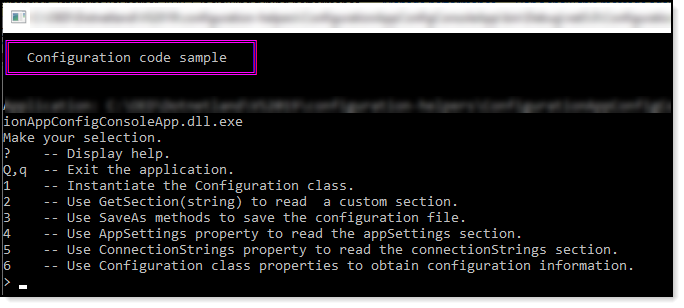

# About

Microsoft [code sample](https://docs.microsoft.com/en-us/dotnet/api/system.configuration.configuration?view=netframework-4.8) on Configuration class. Here the code sample is done with .NET Core

:heavy_check_mark: Minor tweaks for C#9 .NET 5

# Requires

NuGet package [System.Configuration.ConfigurationManager](https://www.nuget.org/packages/System.Configuration.ConfigurationManager/6.0.0-preview.2.21154.6)
