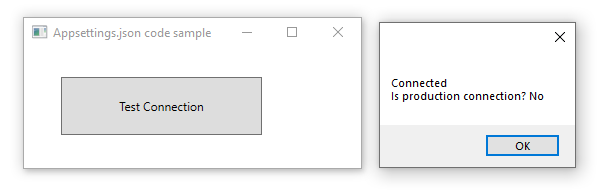

# About

Using .NET Framework 4.8 read connection string from appsettings.json and show it works.




#### appsettings.json

:heavy_check_mark: Change the connection string to match your's

```json
{
  "ConnectionStrings": {
    "DevelopmentConnection": "Server=.\\SQLEXPRESS;Database=School;Integrated Security=true",
    "ProductionConnection": "Server=ProdServerDoesNotExists;Database=School;Integrated Security=true"
  },
  "Environment": {
    "Production": false
  }
}
```

# Test

```csharp
using System;
using System.Data.SqlClient;
using Connections;

namespace ConnectionsFrontEnd.Classes
{
    public class DataOperations
    {
        public static bool TestConnection()
        {
            try
            {
                using (var cn = new SqlConnection() {ConnectionString = Helper.GetConnectionString()})
                {
                    cn.Open();
                    return true;
                }
            }
            catch (Exception)
            {
                /*
                 * Make sure to do logging or some other form
                 * of recovery.
                 */
                return false;
            }
        }
    }
}
```
### Usage

```csharp
MessageBox.Show(DataOperations.TestConnection() ? 
    $"Connected\nIs production connection? {Helper.GetSettings().IsProduction.ToYesNoString()}" : 
    "Connect failed");
```

|Scope|Method/property   |Definition   |
| :---         |  :---  | :--- |
|private|ConfigurationFileName :small_blue_diamond:   |Configuration file in frontend project   |
|public|ConnectionString :small_orange_diamond:   | Used to get one connection string (no environent)   |
|public|UseLogging :small_orange_diamond:   |true to use logging, false no logging   |
|public|GetSettings :small_orange_diamond:  |Get all connection string with environment   |
|public|GetConnectionString :small_orange_diamond:   |Get prod or dev connection string insecure   |
|public|GetConnectionStringSecure :small_orange_diamond:   |Get prod or dev connection string secure   |
|private|InitMainConfiguration :small_orange_diamond:  |Initialize ConfigurationBuilder for appsettings.json   |
|private|InitColumnsConfiguration :small_orange_diamond:  |Initialize ConfigurationBuilder for columnsettings.json   |
|private|ConfigurationBuilderRoot :small_orange_diamond:   |Configuration building   |
|public|InitOptions :small_orange_diamond:  |Generic method to read section in configuration file   |

:small_orange_diamond: method

:small_blue_diamond: property

# Requires
- Microsoft Visual Studio 2019
- Microsoft SQL-Server (minimum Express edition)
- Microsoft SSMS (SQL-Server Management Studio) which is optional for creating the database which can be done in Visual Studio also.

# NuGet packages 

These are required in the [class project](https://github.com/karenpayneoregon/configuration-helpers/tree/master/Connections), not in this project.

[microsoft.extensions.configuration](https://www.nuget.org/packages/Microsoft.Extensions.Configuration/) <br/>
[microsoft.extensions.configuration.binder](https://www.nuget.org/packages/Microsoft.Extensions.Configuration.Binder/)<br/>
[microsoft.extensions.configuration.FileExensions](https://www.nuget.org/packages/Microsoft.Extensions.Configuration.FileExtensions/)<br/>
[microsoft.extensions.configuration.Json](https://www.nuget.org/packages/Microsoft.Extensions.Configuration.Json/)
