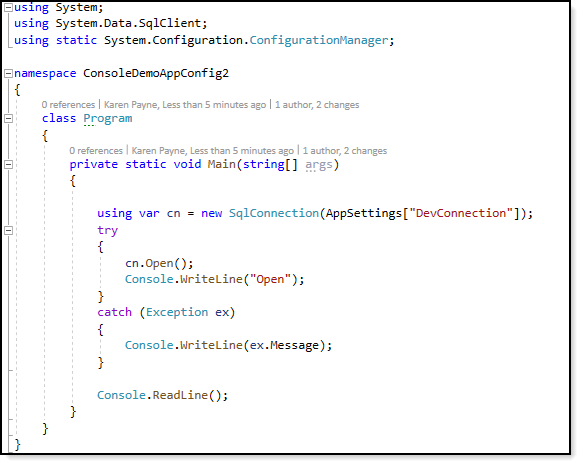
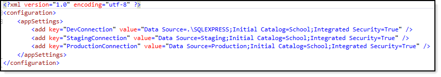

# About

Simple example for reading a user defined connection string from app.config

:heavy_check_mark: Three connections, development, staging and production

# Requires

**reference to**

:heavy_check_mark:  System.Configuration.ConfigurationManager

:heavy_check_mark: System.Data.SqlClient

# Framework

This was done with .NET Framework Core while the same applies to .NET Framework. In .NET Framework System.Data.SqlClient reference is in the references by default and needs to be added for .NET Core.

