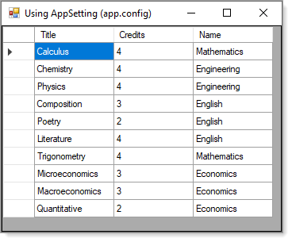

# About

Uses a `connection string` from `app.config` shown below.

```xml
<?xml version="1.0" encoding="utf-8" ?>
<configuration>
    <startup> 
        <supportedRuntime version="v4.0" sku=".NETFramework,Version=v4.8" />
    </startup>
	<appSettings>
		<add key="ConnectionString" value="Data Source=(localdb)\MSSQLLocalDB;Initial Catalog=School;Integrated Security=True;Connect Timeout=30;" />
	</appSettings>
</configuration>
```



### Requires

- A reference to `System.Configuration`
- Run the `data script` under the folder `Scripts`.