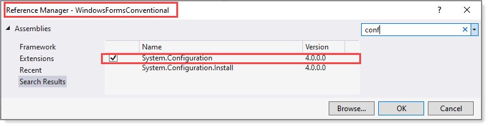

# About

Same code as `WindowsFormConventional`.

| What's different?  |
| :--- |
| WindowsFormConventional project uses the reference System.Configuration from the local machine as per below. |

While WindowsFormConventional1 project gets System.Configuration from NuGet using [this package](https://www.nuget.org/packages/System.Configuration.ConfigurationManager/5.0.0).

So `WindowsFormConventional` uses `version 4` while `WindowsFormConventional1` uses `version 5`.

